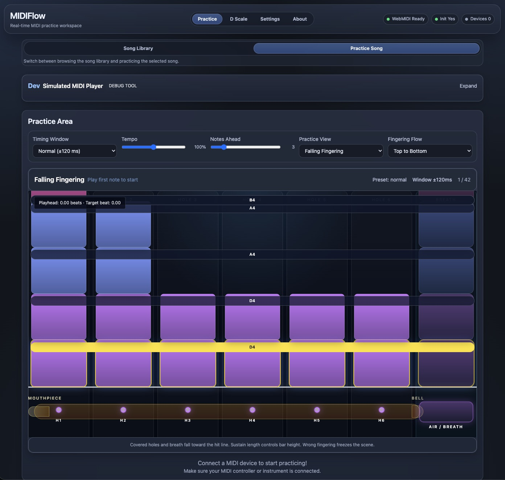

# MIDIFlow
MIDIFlow is a web-based MIDI practice workspace with real-time visual feedback. You can build or import songs, connect a MIDI device, and practice note-by-note with live feedback on timing and pitch.

Tin whistle is the current priority instrument. The most developed practice views, fingering visualizations, and practice flows are built around tin whistle first. Other instrument ranges can be selected in Settings, but the interface and modes are not yet equally specialized for them.



## Note from author
I have always wanted to improve my tooting, but seldom find time and always looking for structured ways to get some practice in with songs I like and find around the web. This project is an attempt to do something that I can use, and once it is mature enough I hope it will be of joy for others out there as well!

/Andreas

## Quick start
1. **Prerequisites**: Chrome/Chromium and a MIDI source (hardware or virtual).
2. **Install**:
   ```bash
   npm install
   ```
3. **Run in foreground (recommended for dev)**:
   ```bash
   ./run-dev.sh
   ```
   This script stops stale MIDIFlow dev server processes scoped to this repo, then starts the app in the foreground so you can use `Ctrl+C` to stop it. (Equivalent direct path: `./scripts/run-dev.sh`.)
4. **Alternative manual run**:
   ```bash
   npm run dev
   ```
5. **Open Settings** to connect a MIDI device, choose an instrument range, and optionally pick the scale used by the dedicated scale practice tab.
6. **Open Practice > Song Library** to choose a built-in song, create a manual song, or import a `.mid` file.
7. **Switch to Practice > Practice Song** to rehearse the selected song with the available practice controls and visual modes.

## Current feature set
- **Song library workflow**: browse built-in songs, import MIDI files, rename saved songs, delete songs, and switch MIDI-derived songs between available tracks.
- **Manual song entry with timing**: enter note names or MIDI numbers, with optional duration syntax like `C4@1 D4@0.5 E4@2` and rests like `R@0.5`.
- **Practice controls**: adjust timing difficulty, tempo multiplier, notes-ahead preview, and switch between supported practice renderers.
- **Tin whistle practice modes**: use the horizontal timeline view or the falling fingering view, with fingering flow direction options in the falling mode.
- **Looped section practice**: in the timeline view, click a note and then Shift-click another to loop a selected range.
- **Scale practice tab**: practice the currently selected major scale from the dedicated scale tab.
- **Persistent local state**: imported and manually created songs, along with key practice preferences, are saved locally in the browser.

## Usage notes
- The richest visual feedback is currently available when `Tin Whistle` is selected as the active instrument.
- Manual timing input uses beats as the unit: `1` = quarter note, `0.5` = eighth note, `2` = half note.
- MIDI-derived songs usually preserve timing better than manually entered untimed note lists, but the result still depends on the source file and chosen track.
- The development build includes a simulated MIDI player for local testing.

## Browser support
- Chrome/Chromium: full WebMIDI/Web Audio support.
- Firefox: limited WebMIDI (Bluetooth/USB support varies).
- Safari: WebMIDI unavailable.

## Architecture overview
- `App.tsx`: top-level tab navigation, song library flow, settings, and practice/session state.
- `PracticeRendererHost`: switches between supported tin whistle practice renderers.
- `TinWhistlePracticeBoard`, `TinWhistleSequentialPractice`, `TinWhistleFallingPractice`: fingering feedback, timeline practice, and falling fingering visualization.
- `DScalePracticePanel`: dedicated major-scale practice flow.
- `SongInput`, `MIDIFileUploader`, `MIDIPreview`: song creation, import, track selection, and preview controls.
- `useMIDI`, `MIDIManager`, `midiFileParser`: WebMIDI and MIDI file handling.
- `storage.ts`: localStorage persistence utilities.

## Status & roadmap
Tin whistle remains the main product direction for now. Broader multi-instrument support is possible from the current structure, but the next iterations should be assumed to deepen the tin whistle experience first: better practice modes, better feedback, cleaner song workflows, and more instrument-specific guidance.
